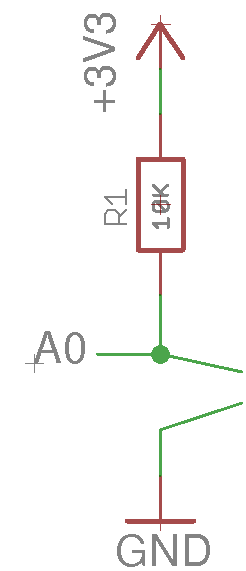

# riffle-thermistor

How-to for connecting a thermistor -- a type of temperature probe -- to a Riffle.

# Thermistor basics

A [thermistor](https://en.wikipedia.org/wiki/Thermistor) provides a simple, precise way of measuring temperature.  The resistance of a thermistor is dependent on temperature in a particular way -- if we know this relationship, then we can measure temperature by measuring the resistance of the thermistor (something we can do with a simple electronic circuit.)

Adafruit has a [great tutorial](https://learn.adafruit.com/thermistor/overview) on thermistors, and measuring them with an Arduino.  The Riffle works very similarly to an Arduino, so their tutorial is a good resource for the Riffle circuitry as well. 

# Choosing a thermistor

There are several types of thermistors, and the relationship between resistance and temperature differs depending on the type.  It's important to know what type of thermistor you're using in order that your circuit and code are appropriate. 

The particular type of thermistor we'll be covering below is an "NTC" or "Negative Temperature Coefficient" thermistor -- which means that the resistance decreases as the temeprature increases.  Typically, for NTC thermistors, the important parameters to know are **B** -- the "B coefficient" of the thermistor -- and **R_o**, the resistance of the thermistor at room temperature (defined as 25 C).  

Here, we're using the same thermistor that is used in the Adafruit tutorial linked to above:

- **R_o** = 10K
- **B** = 3950

These numbers will show up in our Riffle temperature analysis code.

# The Thermistor Circuit

The Riffle, and similar microcontrollers like the Arduino, are only capable of measuring voltages, not resistances. The simplest way to measure the resistance of a thermistor with a microcontroller is to set up a [voltage divider](https://en.wikipedia.org/wiki/Voltage_divider) circuit with the thermistor, **T_1** and another resistor connected in series, which generates a voltage signal that is proportional to the ratio of the resistance of the thermistor and the resistor, **R_1**.

This is what we are depicting in the below circuit diagram:

#  

