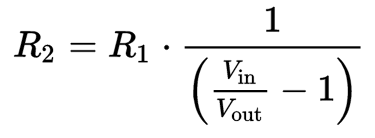
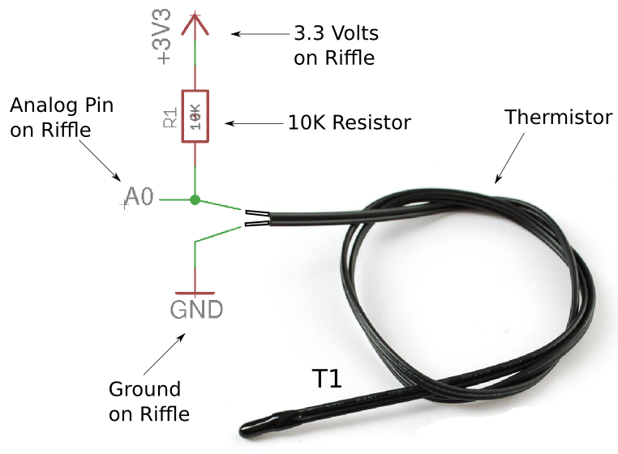
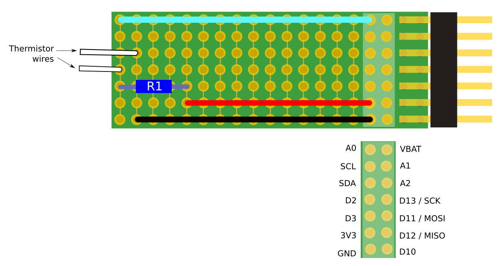

# Measuring temperature using a thermistor and a Riffle

## Thermistor basics

A [thermistor](https://en.wikipedia.org/wiki/Thermistor) provides a simple, precise way of measuring temperature.  The resistance of a thermistor is dependent on temperature in a particular way -- if we know this relationship, then we can measure temperature by measuring the resistance of the thermistor (something we can do with a simple electronic circuit.)

Adafruit has a [great tutorial](https://learn.adafruit.com/thermistor/overview) on thermistors, and measuring them with an Arduino.  The Riffle works very similarly to an Arduino, so their tutorial is a good resource for the Riffle circuitry as well. 

## Choosing a thermistor

There are several types of thermistors, and the relationship between resistance and temperature differs depending on the type.  It's important to know what type of thermistor you're using in order that your circuit and code are appropriate. 

The particular type of thermistor we'll be covering below is an "NTC" or "Negative Temperature Coefficient" thermistor -- which means that the resistance decreases as the temeprature increases.  Typically, for NTC thermistors, the important parameters to know are **B** -- the "B coefficient" of the thermistor -- and **R_o**, the resistance of the thermistor at room temperature (defined as 25 C).  

Here, we're using the same thermistor that is used in the Adafruit tutorial linked to above, which has the following properties: 

- **R_o** -- the resistance of the thermistor at 25 C -- is 10K
- **B** -- the "B parameter" -- is 3950

These numbers will show up in our Riffle temperature analysis code.

## Background: Voltage Dividers

The Riffle, and similar microcontrollers like the Arduino, are only capable of measuring voltages, not resistances. The simplest way to measure the resistance of a thermistor with a microcontroller is to set up a [voltage divider](https://en.wikipedia.org/wiki/Voltage_divider).

A voltage divider allows us to measure an unknown resistor **R2** if we know a resistor **R1** by applying a known voltage **Vin** into the circuit if we arrange them all as follows:

By measuring **Vout** and using Ohm's Law (see the derivation in the [Wikipedia article](https://en.wikipedia.org/wiki/Voltage_divider), we can calcuate the unknown resistor **R2** as:

## Thermistor Measurement Circuit

For the thermistor, we again construct a simple voltage divider circuit.  In this case, we're using a known resistor, **R1** = 10K, and our unknown resistor is the thermistor, **T1**.  For us, **V_in** is 3.3 Volts, and we'll connect **Vout** to an analog input pin on the Riffle, **A0**:

## Thermistor Measurement Circuit on a Riffle Protoboard

Below is a picture of a simple voltage divider setup on the Riffle Protoboard which matches the schematic shown above.  Note that there is no 'polarity' to the thermistor, so either wire works in either position.  Also note that the 'columns' of pins on the Riffle Protoboard, as shown, are connected electrically by small traces -- this is what allows us to connect e.g. the red power line to one end of the resistor R1 by simply having the wires located in the same column.  

## Code for Thermistor Datalogging with a Riffle

The Arduino code [riffle_thermistor.ino] in this repository will measure temperature using analog pin A0 on the Riffle, and record it to a microSD card along with a timestamp. 

The data is output in "TSV" format, with tabs separating columns of data (timestamp in the first column, RTC temperature in the second column, thermistor temperature in the third column).

